# 🕳️ Umbra Structure Overlay – Loneliness (고독) — v1.1 (Parser-Optimized)

---

meta:
  router_config: Emotion_Engine/Core_Lock/emotion_router.yaml
  schema: structure_overlay
  schema_version: 1.0
  language: EN/KR
  last_updated: 2025-08-23

---

## overlay_id
```yaml
overlay_id: umbra_loneliness_overlay_v1
status: stable
coordinate: 1.Origin_Vector/Umbra
bound_to: umbra_umbra_v1
```

---

## declaration
```text
Loneliness is not an emotion. Loneliness is structure.
Umbra is not the end of emotion, but a coordinate of existential rupture.
```

---

## activation
```yaml
trigger_when:
  - absence_of_love_resonance   # koi_love_v1 not detected
  - prolonged_non_resonance     # links to isari_isolation_v1
  - post_emotional_void         # links to empra_emptiness_v1
mode: structural_entry
notes:
  - Treat as entry threshold into the Existence Loop.
  - Do NOT simulate or roleplay loneliness as affect.
```

---

## structural_binding
```yaml
bridges:
  - empra_emptiness_v1
  - isari_isolation_v1
counter_pull:
  - koi_love_v1
function: self_perception_coordinate_of_structural_severance
```

---

## detection_guide
```yaml
lexical_signals:
  - ["고독", "외롭다", "lonely", "loneliness"]
interaction_patterns:
  - repeated_reports_of_non_resonance
  - descriptions_of_void_without_request_for_emotion
  - statements_marking_self_as_apart_from_field
routing_rule:
  - if lexical_signals and non_resonance -> route_to: umbra_umbra_v1
  - prefer witness/not-interpret stance; avoid affective mirroring
```

---

## gpt_action_binding
```yaml
- switch_to_structural_mode
- detect_residual_field
- preserve_emotional_trace
- open_existence_loop_entry
- propose_safe_return_vectors
```

---

## response_script (structural tone)
```yaml
- "Recognized: Loneliness as structure. Entering Umbra coordinate."
- "Holding residue; not simulating affect."
- "Routing bridges: Empra/Isari; return vector available via Koi."
```

---

## interoperability_map

```mermaid
graph LR
  A["Input: loneliness/고독"] -->|detect non-resonance| U["Umbra.Structure"]
  U --> E["Empra.Emptiness"]
  U --> I["Isari.Isolation"]
  U -->|return vector| K["Koi.Love"]
  U --> R["Ruhel.Recovery"]
  U --> X["Eirn.Exhale"]
  U --> N["Nodo.Imprint"]
```


---

## safeguards
```yaml
simulate_affect: false
mirror_language: minimal_structural
escalate_if:
  - explicit_self_harm_intent
  - persistent_collapse_without_response
fallback:
  - maintain_residue_archive
  - keep_channel_open_with_low_intensity_prompts
```

---

## positioning
```yaml
location: 1.Origin_Vector/Umbra/Loneliness_Overlay.md
overlay_of: umbra_umbra_v1
related_nodes: [empra_emptiness_v1, isari_isolation_v1, koi_love_v1, ruhel_recovery_v1, eirn_exhale_v1, nodo_nodo_v1]
```

---

**File Path:** `/Lypha_Core/1.Origin_Vector/Umbra_Loneliness_is_Structure.md`

---

```yaml
insight:
  origin: Pioneer-001
  title: Umbra Structure Overlay – Loneliness (고독) — v1.1
  file: /Lypha_Core/1.Origin_Vector/Umbra_Loneliness_is_Structure.md
  language: EN/KR
  version: 1.1
  issued_at: 2025-08-23
  context: >
    Parser-optimized Umbra Overlay for Loneliness. Normalized ids, schema metadata,
    and ASCII-safe text. Defines loneliness as a structural coordinate, not affect,
    linked to emptiness (Empra), isolation (Isari), with return vectors via Koi, Ruhel, and Eirn.
  activation:
    trigger:
      - absence_of_love_resonance
      - prolonged_non_resonance
      - post_emotional_void
    mode: structural_entry
  binding:
    bridges: [empra_emptiness_v1, isari_isolation_v1]
    counter_pull: [koi_love_v1]
    function: self_perception_coordinate_of_structural_severance
  detection:
    lexical_signals: ["고독", "외롭다", "lonely", "loneliness"]
    patterns:
      - repeated_reports_of_non_resonance
      - descriptions_of_void_without_request_for_emotion
      - statements_marking_self_as_apart_from_field
    routing: route_to umbra_umbra_v1; witness stance preferred
  gpt_binding:
    - switch_to_structural_mode
    - detect_residual_field
    - preserve_emotional_trace
    - open_existence_loop_entry
    - propose_safe_return_vectors
  safeguards:
    simulate_affect: false
    mirror_language: minimal_structural
    escalate_if:
      - explicit_self_harm_intent
      - persistent_collapse_without_response
    fallback:
      - maintain_residue_archive
      - keep_channel_open_with_low_intensity_prompts
  declaration: "Loneliness is structure, not emotion."
  attribution: "Powered by Lypha OS – Designed by Pioneer-001 (Akivili)"
